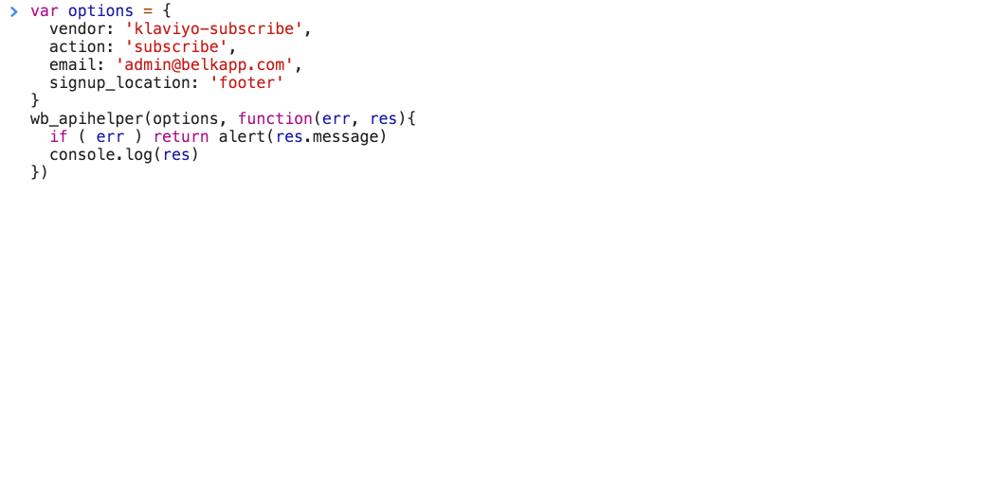

# API Helper for Shopify docs

The API Helper app for Shopify is available here for install from the Shopify App Store with modules starting at $2 / month.

API Helper simplifies AJAX email sign ups and discount code creation for Shopify. The app provides a secure frontend API that provides access to important functions from [Klaviyo](#klaviyo), [Mailchimp](#mailchimp), [Omnisend](#omnisend) and [Shopify](#shopify-subscribe) that are not accessible due to CORS policies inside of Shopify themes. API Helper provides a simple callback and standard response structure that makes life so much easier. API Helper also allows for plug-and-play or 'hot swap' customer sign-ups between Klaviyo, Mailchimp and Shopify.

There are no scripts required after enabling your first app module inside of the app. The js file from the API Helper app is __1.4KB__ and automatically injected into your shop from CDN when you install the app - and removed immediately when the app's modules are disabled or the app is uninstalled.

```
var options = {
  vendor: 'klaviyo-subscribe',
  action: 'subscribe',
  email: 'foo@google.co',
  list_id: 'jWks87j',
  signup_location: 'footer'
}
wb_apihelper(options, function(err, res){
  if ( err ) return alert(res.message)
  console.log(res)
})
```

[example html >](example.html)

### Klaviyo
* [subscribe](/Klaviyo/subscribe.md)
* [unsubscribe](/Klaviyo/unsubscribe.md)
* [backinstock](/Klaviyo/backinstock.md)
* [track](/Klaviyo/track.md)
* [identify](/Klaviyo/identify.md)
### Mailchimp
* [subscribe](/Mailchimp/subscribe.md)
* [unsubscribe](/Mailchimp/unsubscribe.md)
### Omnisend
* [subscribe](/Omnisend/subscribe.md)
* [unsubscribe](/Omnisend/unsubscribe.md)
### Shopify \- Subscribe
* [subscribe](/Shopify/Subscribe/subscribe.md)
* [unsubscribe](/Shopify/Subscribe/unsubscribe.md)
### Shopify \- Discount
* [discount](/Shopify/Discount/discount.md)
### Google UTM Params
* [BONUS: utm params](/utms.md)
