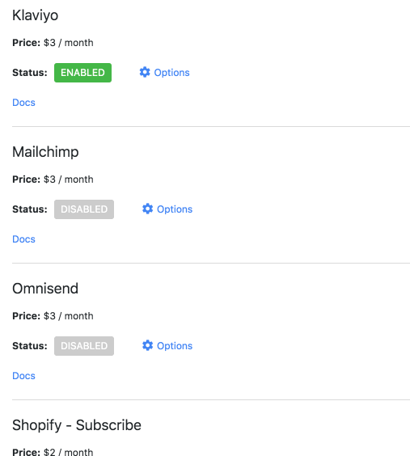

# API Helper for Shopify docs

The API Helper app for Shopify is available here for install from the Shopify App Store with modules starting at $2 / month. Read more about the app here on Medium.

API Helper simplifies AJAX email sign ups and discount code creation for Shopify. The app provides a secure frontend API that provides access to important functions from [Klaviyo](#modules), [Mailchimp](#modules), [Omnisend](#modules) and [Shopify](#modules) that are not accessible due to CORS policies inside of Shopify themes. [Jump to docs](#modules)

API Helper provides a simple callback and standard response structure that makes life so much easier. API Helper also allows for plug-and-play or 'hot swap' customer sign-ups between Klaviyo, Mailchimp, Omnisend, and Shopify.

There are no scripts required to use the app. After enabling your first app module inside of the app, our js file from the API Helper app is injected into your theme at the end of page load. This file is __1.4KB__ and served from Google's CDN. The file is removed immediately when the app's modules are disabled or the app is uninstalled.

## Example Code
```
var options = {
  vendor: 'klaviyo-subscribe',
  action: 'subscribe',
  email: 'foo@google.co',
  list_id: 'jWks87j',
  signup_location: 'footer'
}
wb_apihelper(options, function(err, res){
  if ( err ) return alert(res.message)
  console.log(res)
})
```

## Shopify Admin


## Modules
Modules starting at $2 / month. Each module includes all `action` components shown below. For example, the Klaviyo module costs $3 / month and gives you access to the `subscribe, unsubscribe, backinstock, track, identify` actions.
### Klaviyo - $3 / month
* [subscribe](/Klaviyo/subscribe.md)
* [unsubscribe](/Klaviyo/unsubscribe.md)
* [backinstock](/Klaviyo/backinstock.md)
* [track](/Klaviyo/track.md)
* [identify](/Klaviyo/identify.md)
### Mailchimp - $3 / month
* [subscribe](/Mailchimp/subscribe.md)
* [unsubscribe](/Mailchimp/unsubscribe.md)
### Omnisend - $3 / month
* [subscribe](/Omnisend/subscribe.md)
* [unsubscribe](/Omnisend/unsubscribe.md)
### Shopify \- Subscribe - $2 / month
* [subscribe](/Shopify/Subscribe/subscribe.md)
* [unsubscribe](/Shopify/Subscribe/unsubscribe.md)
### Shopify \- Discount - $2 / month
* [discount](/Shopify/Discount/discount.md)
### Google UTM Params
* [BONUS: utm params](/utms.md)
