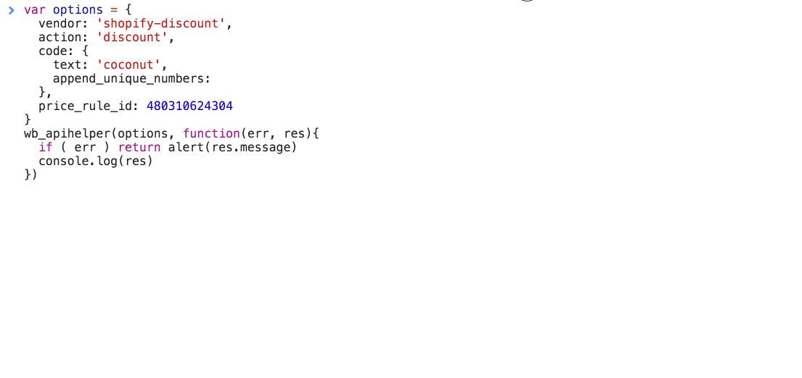
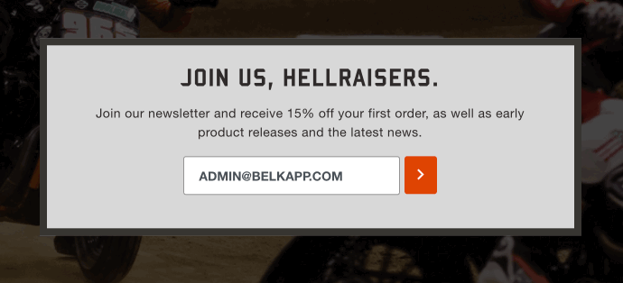

## Shopify Price Rule Instructions
You must create a Price Rule in Shopify for this module to work.

Go to __https://{{your-shop-name}}.myshopify.com/admin/discounts__ and click __Create discount__. Create your price rule. At the end of the url you will find the `price_rule_id` __https://{{your-shop-name}}.myshopify.com/admin/discounts/480310624304__.
```
var options = {
  vendor: 'shopify-discount',
  action: 'discount',
  code: {
    text: 'coconut', // this is the beginning of your discount code
    append_unique_numbers: true
  },
  price_rule_id: 480310624304
}
wb_apihelper(options, function(err, res){
  if ( err ) return alert(res.message)
  console.log(res)

  // res: { statusCode: 200 || 400, message: '...', data: { code: 'COCONUT_1562626929328' , price_rule_id: '480310624304' } }
})
```
## Required `options`
* `vendor`
* `action`
* `code`
* `code.text`
* `price_rule_id`

## Description
This will generate a unique discount code if `options.code.append_unique_numbers === true`. The unique discount code is generated as uppercase character plus milliseconds timesamp: `COCONUT_1562626929328`.

If `options.code.append_unique_numbers === false` or `options.code.append_unique_numbers` is not included, the code from the above example will be generated as `COCONUT` and can only be generated once.




## Advanced Example
If you want to provide a discount code after successful newsletter signup, you can do this in the same transaction instead of doing two separate calls. On any of the `subscribe` modules you can do this, for `klaviyo`, `mailchimp`, `omnisend` and `shopify`. Your code might look something like this:
```
<form class="the_form" data-list_id="AsSWZs">
  <label>Newsletter Signup</label>
  <input type="text" name="email" value="" placeholder="Your email">
  <button>Sign Up</button>
</form>
<script>
  $(function(){
    $('.the_form').submit(function(e){
      e.preventDefault()
      var options = {
        vendor: 'klaviyo-subscribe',
        action: 'subscribe',
        email: $(this).find('input[name="email"]'),
        list_id: $(this).attr('data-list_id'),
        signup_location: 'newsletter overlay',
        phone: '2135551212',
        'Custom Property': 'foobar',
        code: {
          text: '10off',
          append_unique_numbers: true
        },
        price_rule_id: '480310624304'
      }
      wb_apihelper(options, function(err, res){
        if ( err ) return alert(res.message)
        console.log(res)

        // res: { statusCode: 200 || 400, message: '...', data: { code: 'COCONUT_1562626929328' , price_rule_id: '480310624304' } }

        $(this).hide()
      })
    })
  })
</script>
```
